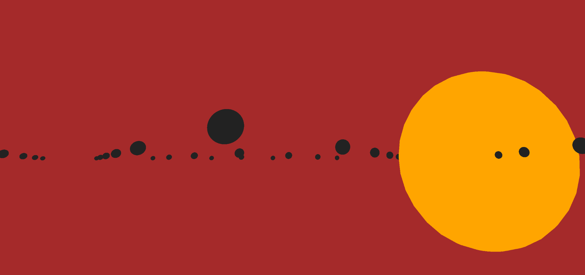

# mini_ex1 - Alternative Abstract Solarsystem by Frederik Ditlev Christensen
#### Screenshot of mini_ex1:

#### Short introduction:
The following project is a virtual representation of floating spheres in an open space. It might look to you as a solar system of some kind - in this case my work has succeeded. The spheres are comepletely still while the camera is moving slowly in a sinus curve which makes it seem like the spheres are moving although they are not.
#
#### Click to go [Outer space](http://rawgit.com/Mightydeeze/mini_ex/mini_ex_main/mini_ex1/Excercises/empty-example/index.html)
#
#### My code process:
This coding process has been my first of many to come, and because of this I didn't really structurerize my steps from the beginning till the end as I did not know much about the possibilities of P5.js at this state. In the beginning I was just fascinated by the idea of working with 3D modelling in a webbrowser which led the to end result. In the beginning I searched the internet for car models in the format of objects (obj.) as this format is understandable by p5.js. Unfortunately I had a tough time finding cars so I decided to use more common shapes that would not need to be imported. 
#
#### The steps in making the program (sort of):
My next thought became to make a fully functional solar system with planets in orbit, but I simply couldn't find the right formulars so I came up with other alternatives. 

1. First I made a canvas in 3D like so: createCanvas(1600,1000,WEBGL)

2. Next I copied the function ['perspective()'](https://p5js.org/reference/#/p5/perspective) from p5js.org, changed the boxes into spheres and modified the numbers to make more rows and bigger spaces between them. 

3. Then I deleted the 'OrbitControl();' because I didn't want the viewer to control the angle of perspective.

4. To move the camera I made use of the function [camera()](https://p5js.org/reference/#/p5/camera) with different numbers that made the camera travel further and with a slower speed. 

5. I gave color to the Spheres with the function [color()](https://p5js.org/reference/#/p5/color) and the background.

6. I made a bigger sphere as a sun and gave it color as well.
#
#### Coding compared to writing text:

How your coding process is differ or similar to reading and writing text? (You may also reflect upon Annette Vee's text on coding literacy)
What might be the potential and possibility of coding practice?

## My code:
#### function setup() {
  
  createCanvas(1600, 1000, WEBGL);
  
  var fov = 60 / 180 * PI;
  
  var cameraZ = height / 2.0 / tan(fov / 2.0);
 
  perspective(60 / 180 * PI, width / height, cameraZ * 0.1, cameraZ * 10); }
  
#### function draw() {

  background('brown');

  for (var i = -1; i < 20; i++) {
  
  for (var j = -2; j < 20; j++) {
   
  push();
   
  translate(i * 160, 0, j * 150);
   
  c = color('#222222');
   
  fill(c); 
   
  noStroke();
   
  sphere(5, 40, 40);
   
  pop();
   
  camera(750, 10, sin(frameCount * 0.0009) * 600, 0, -200, 200, 0, 4, 0);
  
  var c = color('orange'); 
  
  fill(c); 
  
  noStroke(); 
  
sphere(150);

  }
  
  }
  #
Best regards
Frederik Ditlev Christensen

