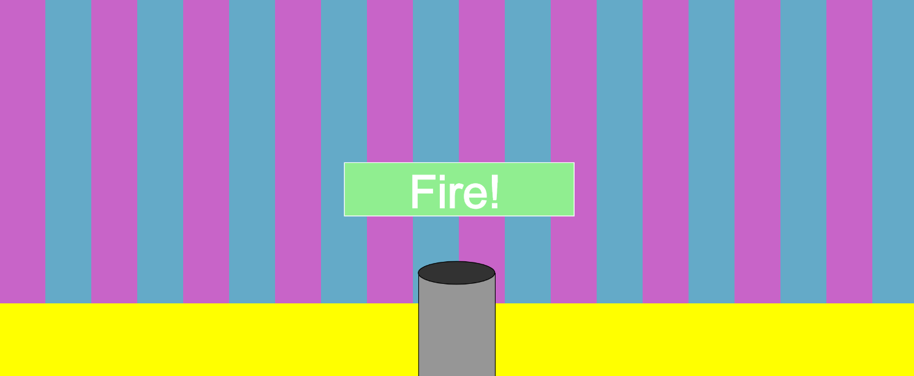

# mini_ex2:
Go to mini_ex:
[1](https://github.com/Mightydeeze/mini_ex/tree/mini_ex_main/mini_ex1),2,
[3](https://github.com/Mightydeeze/mini_ex/tree/mini_ex_main/mini_ex3),
[4](https://github.com/Mightydeeze/mini_ex/tree/mini_ex_main/mini_ex4),
[5](https://github.com/Mightydeeze/mini_ex/tree/mini_ex_main/mini_ex5),
[6](https://github.com/Mightydeeze/mini_ex/tree/mini_ex_main/mini_ex6),
[7](https://github.com/Mightydeeze/mini_ex/tree/mini_ex_main/mini_ex7)...
## Color_canon 1.0 by Frederik Ditlev Christensen
#### Screenshot of mini_ex2:

#### Short introduction:
This project is an atempt to express fun in a way that is rediculous in my opinion. The visitters of this program are able to control a canon with their mouse. With a press of the mouse, a colored ball is shot from the canon into the air with a weird noise. The program is formed like a game although it might miss some fundamental features to be one. It is recommended to try it out with sound, but keep in mind that some sounds have a slightly higher volume.    
#
#### Click to [Fire up the canon](https://rawgit.com/Mightydeeze/mini_ex/mini_ex_main/mini_ex2/Excercises/empty-example/index.html)
#
#### Fun in software: 
In the introduction of the magazine "Fun and Software: Exploring Pleasure, Paradox and Pain in Computing.", Olga Goriunova says: 

"There is a particular fun that finds its fascination in logic. The acquisition of language, notation and the establishment of the practice of programming include fun as a mode of production that oscillates between abstraction, normativity and paradox or the absurd". (2014) pp. 10.

In this part of the text, Olga is referring to programming as a certain kind of logic which can be seen as 'fun'. I can relate to her thoughts on this topic as I in person finds it fascinating to encounter the challenges that may be in the programming process. When this is mentioned, I can see how, despite all this logic, that within the process lies an opportunity to try out new things as the process evolves. It's almost as if it drives you to continue - at least in my case. 

After the software is made there will be signs of the same 'fun' as was involved in the making of the proces. Not only does the notion of fun cover the rational parts of software but also the artistic and irational parts.

#
## My code:
https://github.com/Mightydeeze/mini_ex/blob/mini_ex_main/mini_ex2/Excercises/empty-example/sketch.js
  #
 Best regards 
#### Frederik Ditlev Christensen

Go to mini_ex:
[1](https://github.com/Mightydeeze/mini_ex/tree/mini_ex_main/mini_ex1),2,
[3](https://github.com/Mightydeeze/mini_ex/tree/mini_ex_main/mini_ex3),
[4](https://github.com/Mightydeeze/mini_ex/tree/mini_ex_main/mini_ex4),
[5](https://github.com/Mightydeeze/mini_ex/tree/mini_ex_main/mini_ex5),
[6](https://github.com/Mightydeeze/mini_ex/tree/mini_ex_main/mini_ex6),
[7](https://github.com/Mightydeeze/mini_ex/tree/mini_ex_main/mini_ex7)...
