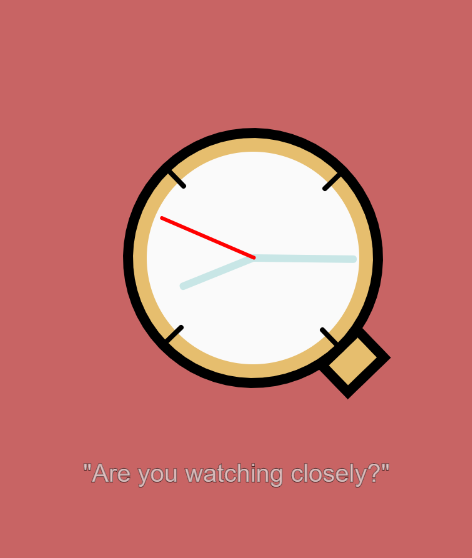

# mini_exX:
## Time_is_patient by Frederik Ditlev Christensen
#### Screenshot of mini_ex3:

#### Short introduction:

#
#### Click to ["waste" some time](https://rawgit.com/Mightydeeze/mini_ex/mini_ex_main/mini_ex3/Excercises/empty-example/index.html)
#
#### :
"But as I argue in my book, Waiting for Word, we are looking at waiting entirely wrong. Waiting isn’t essentially a wasted in-between time; instead waiting is a core part of messages we send each other across the fiber optic lines. The time it takes to receive and interpret a message is also part of its content. We take the moment of waiting and give it meaning; it becomes a message of its own."

Taken from http://reallifemag.com/fidget-spinners/

#
#### :

## My code:

  #
 Best regards 
#### Frederik Ditlev Christensen

