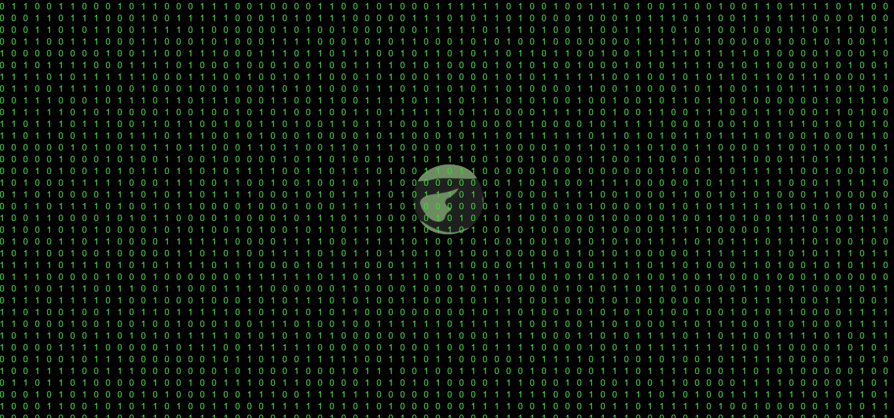
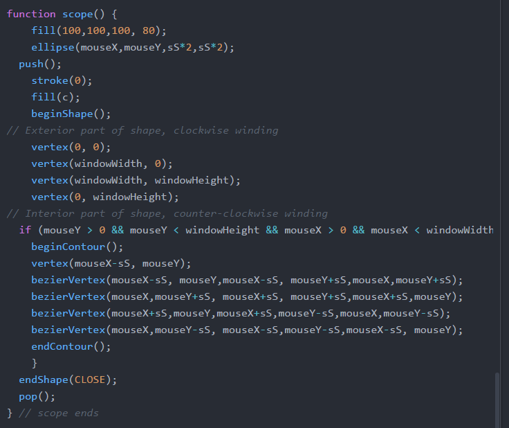

# mini_ex4:
Go to mini_ex:
[1](https://github.com/Mightydeeze/mini_ex/tree/mini_ex_main/mini_ex1),
[2](https://github.com/Mightydeeze/mini_ex/tree/mini_ex_main/mini_ex2),
[3](https://github.com/Mightydeeze/mini_ex/tree/mini_ex_main/mini_ex3),4,
[5](https://github.com/Mightydeeze/mini_ex/tree/mini_ex_main/mini_ex5),
[6](https://github.com/Mightydeeze/mini_ex/tree/mini_ex_main/mini_ex6),
[7](https://github.com/Mightydeeze/mini_ex/tree/mini_ex_main/mini_ex7)...
## Capture_all by Frederik Ditlev Christensen
#### Screenshot of mini_ex4:

#### Short introduction:
The following project is an attempt to visualize an interpretation of the fear of being watched by others online. Although we cannot see it, we might be under surveillance and our data is leaking - Are we going to pay the price for all our sins? In this particular case you will!

The program doesn't need a microphone or webcam to run as it only relies on the use of the mouse. **The main events happen with the mouse clicks. However, please try to search around the canvas before clicking to get the best experience :)** Enjoy!
#
#### Click to [Be observed](https://rawgit.com/Mightydeeze/mini_ex/mini_ex_main/mini_ex4/Excercises/empty-example/index.html)
#
#### Data Capture:
How many times haven't we used the internet for something "illegal"? And how many of those times have we actually been aware of this? Why do we need to pay for stuff when it's out there on the internet for free? Copyright is such a big deal today, but still so many internet pirates are on the loose. We (in general) want freedom on the internet in contrast to the law proposals against it (laws such as **S.O.P.A & P.I.P.A**). If the laws became a thing there wouldn't be such things as youtube, facebook or twitter due to shotdowns. All our data would be under constant surveillance in order to controll our behavior online. This is already happening to a certain extent in the USA and countries as China.
#
#### My coding process:
At first I wanted to make some kind of search bar with suggestions to political toppics as if someone already had searched for the toppics. Allthough, I really wanted to let the program appeal to our conscience. So I decided to make a bit creepy atmosphere with "someone" watching the user. 

I started by making the numbers with a **for loop** and random numbers between 1 and 0 to represent the interface which someone sees through. Then I imported the image of the "observer" and [translated](https://p5js.org/reference/#/p5/translate) it to the center of the screen. For the peephole I had a bit of trouble as it is a shape that covers the whole screen (a rectangle) minus an ellipse at the position of the mouse. I figured out that this is possible with the syntax [endContour()](https://p5js.org/reference/#/p5/endContour), but instead of using ordinary vertexes for the ellipse I used [bezierVertex()](https://p5js.org/reference/#/p5/bezierVertex) as shown in the picture below:

The last things I did were to make the alerts with a little delay on the mouse clicks and to make an event that clears and shifts the background image at the right amount of clicks.

## My code:
https://github.com/Mightydeeze/mini_ex/blob/mini_ex_main/mini_ex4/Excercises/empty-example/sketch.js
  #
 Best regards 
#### Frederik Ditlev Christensen

Go to mini_ex:
[1](https://github.com/Mightydeeze/mini_ex/tree/mini_ex_main/mini_ex1),
[2](https://github.com/Mightydeeze/mini_ex/tree/mini_ex_main/mini_ex2),
[3](https://github.com/Mightydeeze/mini_ex/tree/mini_ex_main/mini_ex3),4,
[5](https://github.com/Mightydeeze/mini_ex/tree/mini_ex_main/mini_ex5),
[6](https://github.com/Mightydeeze/mini_ex/tree/mini_ex_main/mini_ex6),
[7](https://github.com/Mightydeeze/mini_ex/tree/mini_ex_main/mini_ex7)...
