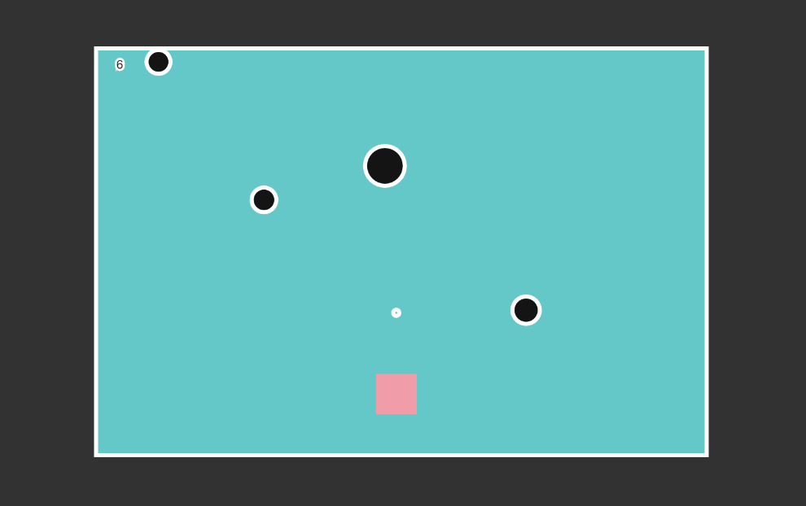
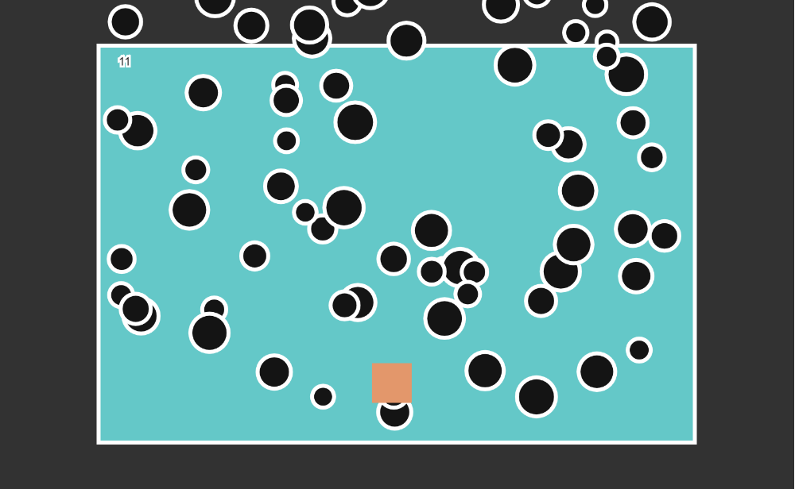

# mini_ex5:
Go to mini_ex:
[1](https://github.com/Mightydeeze/mini_ex/tree/mini_ex_main/mini_ex1),
[2](https://github.com/Mightydeeze/mini_ex/tree/mini_ex_main/mini_ex2),
[3](https://github.com/Mightydeeze/mini_ex/tree/mini_ex_main/mini_ex3),
[4](https://github.com/Mightydeeze/mini_ex/tree/mini_ex_main/mini_ex4),5, 
[6](https://github.com/Mightydeeze/mini_ex/tree/mini_ex_main/mini_ex6),
[7](https://github.com/Mightydeeze/mini_ex/tree/mini_ex_main/mini_ex7),
[8](https://github.com/Mightydeeze/mini_ex/tree/mini_ex_main/mini_ex8),
[9](https://github.com/Mightydeeze/mini_ex/tree/mini_ex_main/mini_ex9),
[Final Project](https://github.com/Mightydeeze/mini_ex/tree/mini_ex_main/Final%20Project)
## shape_invaders by Frederik Ditlev Christensen
#### Screenshot of mini_ex5:

#### Short introduction:
The following project does not function correctly, as I had some trouble in my coding process - a bit of a shame - however, it is an attempt to show that even a small amount of information can be used to form objects in the digital world. Of course it was meant to be a game as well...

In the "game", the player controls a box on a blue canvas by the buttons "w", "a", "s" and "d". By pressing the "space bar", bullets are fired from the box in order to hit and destroy the invading circles. Due to the problems in my process, I couldn't manage to get this mini exercise done in time, and I decided to just leave it with all it's flaws.

Enjoy the mess!

**Warning**: The following content has some rapidly shifting colors that may lead to some discomfort for people who suffer from epileptic disorders.
#
#### Click to [Stop the invasion!](https://cdn.rawgit.com/Mightydeeze/mini_ex/mini_ex_main/mini_ex5/Excercises/empty-example/index.html)
#
#### Object Oriented:
When you think of objects in the real world and compare them with similar objects in the digital world, some properties might be missing. (although in some cases it may have even more properties in the digital world due to augmentations.) The creater of the virtual objects selects between all thoose properties to make his/her own expression of the object. Even theese two words "his" and "her" indicates that there are only two genders (male and female) which is a common view on genders when it comes to online social media accounts/profiles, in opposition to the view on genders outside the social media. 

In my game, I have chosen to use simple shapes which makes a great contrast to the real world with all it's complexity in general. Physics in games can be completely as you like (if you can code it), which also is much different in the real world, as the physics always stay the same. By not being done, my game messes with the whole idea about how games should work, unless you know that it is not on purpose. This element of failure does of course not only belong to the virtual world as failures happen all the time in the real world too.
#
#### My coding process:
In the beginning I wanted to make a game about putting things in boxes as a metaphor to how we as humans have a tendency to make to generelyze everything in order to better understand it. I think this verion would be a good interpretation of this mini exercise, but for some reason I chose to make something else - I guess it seemed as a more fun approach to the topic.

In my coding process I focused on the **"class"** syntax due to the requirements of this mini exercise although I could have made the task in other easier ways. As in Daniel Shiffmans coding challenge [#46.1](https://www.youtube.com/watch?v=hacZU523FyM) & [#46.2](https://www.youtube.com/watch?v=xTTuih7P0c0), he creates whole new **js**-files instead of using **class**. By choosing **classes** instead, I had a hard time figuring out how to make the objects (bullets and obstacles) collide with each other. And when they finally collided, all the obstacles would be removed.

I wanted to import a "game over" function to the game, which seems possible, but now I have just leaved it out although it appears in the code.

I want to say sorry in advance for the my (what might be) confusing code.
#
## My code:
https://github.com/Mightydeeze/mini_ex/blob/mini_ex_main/mini_ex5/Excercises/empty-example/sketch.js
  #
 Best regards 
#### Frederik Ditlev Christensen

Go to mini_ex:
[1](https://github.com/Mightydeeze/mini_ex/tree/mini_ex_main/mini_ex1),
[2](https://github.com/Mightydeeze/mini_ex/tree/mini_ex_main/mini_ex2),
[3](https://github.com/Mightydeeze/mini_ex/tree/mini_ex_main/mini_ex3),
[4](https://github.com/Mightydeeze/mini_ex/tree/mini_ex_main/mini_ex4),5,
[6](https://github.com/Mightydeeze/mini_ex/tree/mini_ex_main/mini_ex6),
[7](https://github.com/Mightydeeze/mini_ex/tree/mini_ex_main/mini_ex7),
[8](https://github.com/Mightydeeze/mini_ex/tree/mini_ex_main/mini_ex8),
[9](https://github.com/Mightydeeze/mini_ex/tree/mini_ex_main/mini_ex9),
[Final Project](https://github.com/Mightydeeze/mini_ex/tree/mini_ex_main/Final%20Project)
