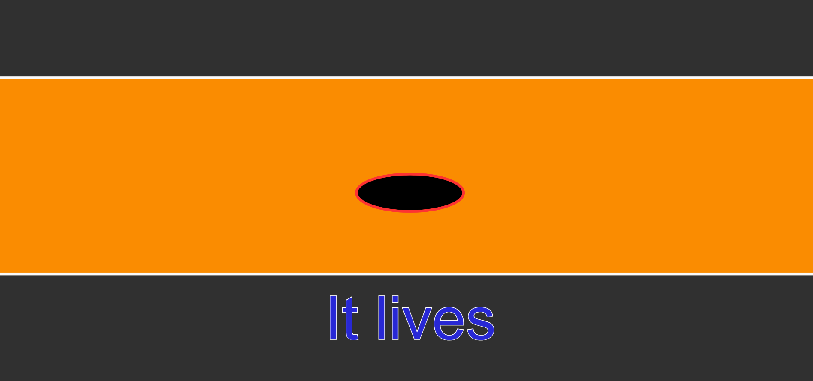

# mini_ex6:
Go to mini_ex:
[1](https://github.com/Mightydeeze/mini_ex/tree/mini_ex_main/mini_ex1),
[2](https://github.com/Mightydeeze/mini_ex/tree/mini_ex_main/mini_ex2),
[3](https://github.com/Mightydeeze/mini_ex/tree/mini_ex_main/mini_ex3),
[4](https://github.com/Mightydeeze/mini_ex/tree/mini_ex_main/mini_ex4),
[5](https://github.com/Mightydeeze/mini_ex/tree/mini_ex_main/mini_ex5), 6...
## babble_mouth by Frederik Ditlev Christensen
#### Screenshot of mini_ex6:

#### Short introduction:
This program is a colorful combination of an everchanging ellipse on an orange rectangle along with different pairs of words underneath. 
The quick movements in the shapes looks almost as a rapidly speaking mouth that babbles alot - the text should help underlining this.

The program has no audio - although I think it would be cool with a real babble!

Enjoy!
#
#### Click to [listen to the babbling]()
#
#### Generativity:
the "words" are not just words but the 50 most used english verbs worldwide, according to this website: https://www.ef.com/english-resources/english-vocabulary/top-50-verbs/. In my program, the verbs are pared with 7 pronouns in random compositions which means there are 350 different pairs as 7 times 50 is equal to 350 - a huge number if you ask me - which means that you have to be lucky to get the same combination of pronoun and verb.

In terms of genarity, I as the author have chosen all the words for the program - well the world chose them - so the computer does not have the full responsability for the artwork. The full process is being automated and executed my the machine and can be run on multiple browsers, each in their own unique way without me lifting a finger. However, I have set the rules for the machine to follow and chosen the colors that I desired - It could have all been random instead. 

When the pairs of words are getting generated so quickly - slow for the computer though - To a certain extent the words get overused and lose their meaning. Although it may seem like the computer is communicating and generating words as if it was thinking on them, the fact that computers can not use their intuition and respond to contexts (yet) becomes a challenge in generativity when the context gets very complex.

#
#### My coding process (in progress):

#
## My code:
https://github.com/Mightydeeze/mini_ex/blob/mini_ex_main/mini_ex6/Excercises/empty-example/sketch.js
  #
 Best regards 
#### Frederik Ditlev Christensen

Go to mini_ex:
[1](https://github.com/Mightydeeze/mini_ex/tree/mini_ex_main/mini_ex1),
[2](https://github.com/Mightydeeze/mini_ex/tree/mini_ex_main/mini_ex2),
[3](https://github.com/Mightydeeze/mini_ex/tree/mini_ex_main/mini_ex3),
[4](https://github.com/Mightydeeze/mini_ex/tree/mini_ex_main/mini_ex4),
[5](https://github.com/Mightydeeze/mini_ex/tree/mini_ex_main/mini_ex5), 6...
