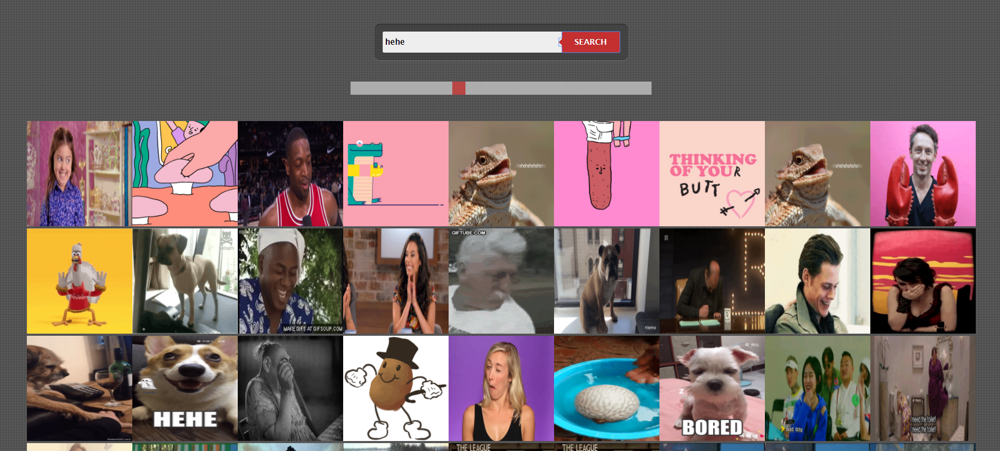

#  mini_ex8: 
Go to mini_ex:
[1](https://github.com/Mightydeeze/mini_ex/tree/mini_ex_main/mini_ex1),
[2](https://github.com/Mightydeeze/mini_ex/tree/mini_ex_main/mini_ex2),
[3](https://github.com/Mightydeeze/mini_ex/tree/mini_ex_main/mini_ex3),
[4](https://github.com/Mightydeeze/mini_ex/tree/mini_ex_main/mini_ex4),
[5](https://github.com/Mightydeeze/mini_ex/tree/mini_ex_main/mini_ex5), 
[6](https://github.com/Mightydeeze/mini_ex/tree/mini_ex_main/mini_ex6),
[7](https://github.com/Mightydeeze/mini_ex/tree/mini_ex_main/mini_ex7), 8,
[9](https://github.com/Mightydeeze/mini_ex/tree/mini_ex_main/mini_ex9),
[Final Project](https://github.com/Mightydeeze/mini_ex/tree/mini_ex_main/Final%20Project)
# The GIFter 
By Alexander Svanholm, Anne Gregersen & Frederik Ditlev

### What is the Program?

The user is given the option to search and find gifs from the giphy.com library. When looking up a term to search for, the program GIFts you with a series of GIF images. Originally, the user was supposed to write in words associated with another word. Words like beach, ice cream, and sun would go with summer, and snow, icicles, and fireplace could go with winter, for instance. This idea was ruined a little by the user’s ability to search for completely unrelated terms, such as typing “Easter bunny” when tasked with thinking about Christmas. As we didn’t know of any way to constrain the user to a specific section of search terms which would be deemed “acceptable,” we opted for, instead, to attempt to further understand the nature of APIs, as well as HTML and CSS coding.

The code and the program itself are both very simple. The complexity arrives when dealing with the HTML and CSS. The program simply looks up the term to search for on giphy.com and returns a series of images depending on what you typed. The styling of the search field, as well as the background, was done with CSS. The code for that was taken from an online source and modified to suit our needs, and also to help us better understand CSS. As no one in the group was truly comfortable with CSS, we preferred handling code which we knew would work, and then working further on from there.

Besides finding GIFs based on keywords, we wanted the user to interact even more with the program. We decided to implement a horizontal range slider as well so that the user could control the amount of GIFs showed on-screen. We created a custom range slider with CSS, set the minimum value of the slider to 1 (as we wanted the program to always show at least one image when a keyword has been entered), set the maximum value of the slider to 100 (100 GIFs to be shown) and set the default value of the slider to 50. **Go crazy! GIPHY allows for all keys to have a maximum of 10k requests a day.**

#### Screenshot of mini_ex8:

#### Click to [get GIFted:](https://rawgit.com/ubiquitousman/mini-ex/master/mini_ex8/p5/the_gifter/index.html)
#
#### Code Collaboration:

This project was the collaborative effort of [Alexander Svanholm](https://github.com/ubiquitousman/mini-ex), [Anne Gregersen](https://github.com/AnnesFlashBack/Mini-Exercises), and [Frederik Ditlev](https://github.com/Mightydeeze/mini_ex/tree/mini_ex_main). Since we are the only three members of our study group, we did not really have the options to switch up who we were working with, so we just stuck with the members of the study group.

We encountered a lot of frustrations with this exercise, especially because we were making use of a lot of HTML and CSS code; something the group didn’t have a lot of collective experience with. This meant that some simple errors were very hard to fix. Most things would take a really long time to understand, and on top of everything we were also working with APIs - something that is not inherently easy either.
In the end, be it either from the difficulty of working with code we’d never seen before, or from the frustrations we experienced from issues we didn’t understand, we ended up making a rather simple program. It could have been more complex, certainly, but given our lack of knowledge with our chosen tools, this is close to the best we could do.

#### Individual Analysis: 
During the making of this project we made use of a rather huge quantity of **CSS** along with **HTML**. Exactly how theese "languages" work is not anything I can speak much of. Luckily for me, the handling of the data provided by the API is taken care of in the **Javascript** in the **Sketch.js** which makes much more sense to me. 

The type of data that is the most common for dealing with APIs is **JSON**. This format is readable for most coding programs, including Atom. So when we make a request with a keyword to the API, it will search the database provided by the offering company/website. Then the API fetches the items (in this case a total of hundred 100) from the database and sort them as objects in the **JSON** file for us to use.

If we had some more time with this exercise, it could be interesting to investigate further into the opportunities of using the API as memory - a bit like cookies and the subject of data capture.
Questions that could be answered:
Is it possible to store data on an API? Is there another alternative that is better? Can we make our own API as our own kind of cloud?

## Our code:
#### Index file:
https://github.com/Mightydeeze/mini_ex/blob/mini_ex_main/mini_ex8/Excercises/empty-example/index.html
#### Sketch file:
https://github.com/Mightydeeze/mini_ex/blob/mini_ex_main/mini_ex8/Excercises/empty-example/sketch.js
#### Styling (CSS):
https://github.com/Mightydeeze/mini_ex/blob/mini_ex_main/mini_ex8/Excercises/empty-example/style.css
  #
 Best regards
#### Alexander Svanholm, Anne Gregersen & Frederik Ditlev

Go to mini_ex:
[1](https://github.com/Mightydeeze/mini_ex/tree/mini_ex_main/mini_ex1),
[2](https://github.com/Mightydeeze/mini_ex/tree/mini_ex_main/mini_ex2),
[3](https://github.com/Mightydeeze/mini_ex/tree/mini_ex_main/mini_ex3),
[4](https://github.com/Mightydeeze/mini_ex/tree/mini_ex_main/mini_ex4),
[5](https://github.com/Mightydeeze/mini_ex/tree/mini_ex_main/mini_ex5), 
[6](https://github.com/Mightydeeze/mini_ex/tree/mini_ex_main/mini_ex6),
[7](https://github.com/Mightydeeze/mini_ex/tree/mini_ex_main/mini_ex7), 8,
[9](https://github.com/Mightydeeze/mini_ex/tree/mini_ex_main/mini_ex9),
[Final Project](https://github.com/Mightydeeze/mini_ex/tree/mini_ex_main/Final%20Project)
