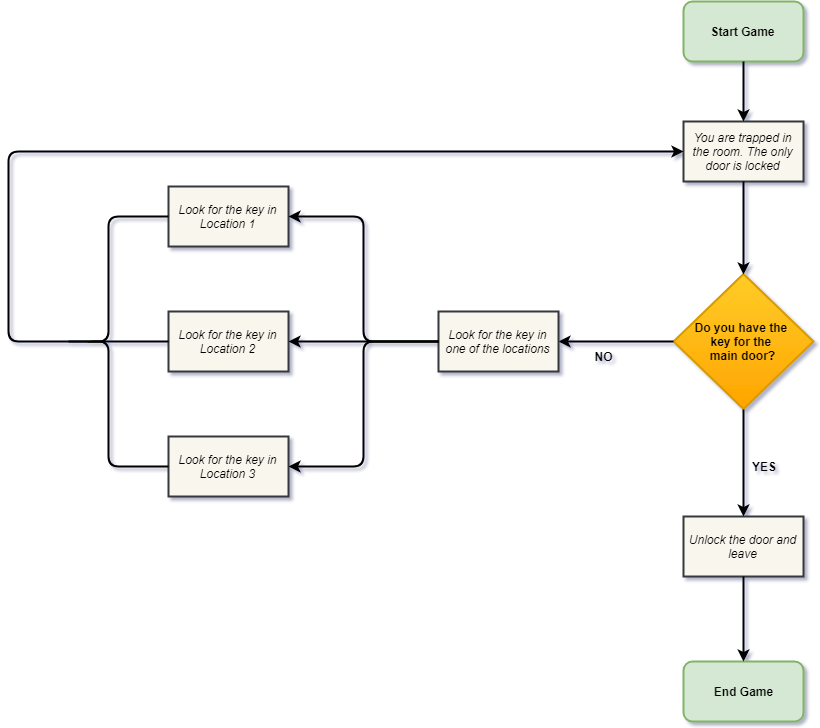
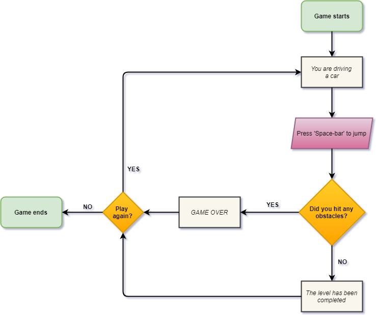
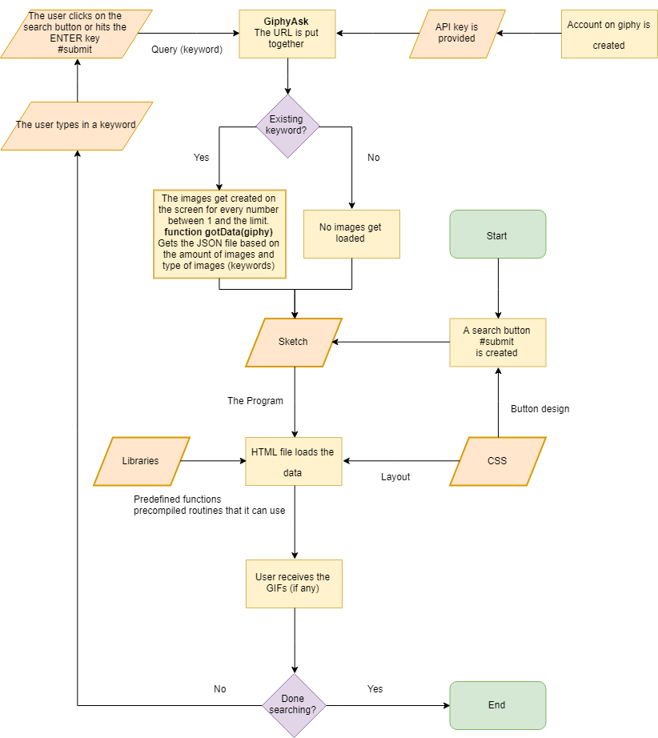

# Flowcharts
By Alexander Svanholm, Anne Gregersen & Frederik Ditlev

### The Escape Room

You are trapped inside a room and must try to figure out how to escape before the time runs out. The player needs to solve puzzles in order to get out. These puzzles can involve ciphers, finding hidden objects, filling out crosswords, matching patterns, etc..

Potential physical components of the game: Hidden doors, locked doors, locks, keys, multiple rooms.

A possible challenge for this idea might be the gathering of all the data we need, as we need to gather all the information and pictures ourselves. It will be very time consuming and require quite a bit of coordination (It would be silly to start the photoshoot before we knew what would actually be relevant to the program).

#### Flowchart of The Escape Room

### Platform Sidescroller

You are in control of a small, simple, vehicle that is driving along the road. Throughout, obstacles will appear and hitting them will crash your car. If you can successfully avoid all the obstacles and get to the end of the level, you win and may be allowed to go on to the next stage.

With this program, a challenge we could encounter is the difficulty in communicating the controls to the user. We thought of this program as a way to explore a user’s innate understanding of basic control schemes found in video games, and a technical challenge for this would be to adequately communicate the limited functions of the game to the user without using blocks of text.

#### Flowchart of Platform Sidescroller

#### Individual Analysis:
**Insert text here**

Revisit your previous mini exercises and select the most technically complex one. Draw an individual flow chart to present the program

I have chosen to make a flowchart to describe miniEx_8 (the one concerning API's)

Individual: How is this flow chart different from the one that you had in  (in terms of the role of a flow chart)?

Individual: If you have to bring the concept of algorithms from flow charts to a wider cultural context, how would you reflect the notion of algorithms? (see if you could refer to the text and articulate your thoughts?)

## Our team:
#### Alexander:
https://github.com/ubiquitousman
#### Anne:
https://github.com/AnnesFlashBack
#### Frederik:
https://github.com/Mightydeeze  #
 Best regards
#### Alexander Svanholm, Anne Gregersen & Frederik Ditlev

